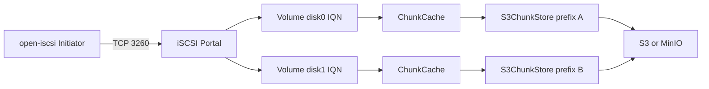

# iSCSI → S3 Block Target (Rust)

## Goal

Ship a binary that listens as an iSCSI target (port 3260). Initiators see one or more block disks; every SCSI read/write maps to S3 `GetObject` / `PutObject` against fixed-size chunk objects. Disks can grow without rewriting existing chunks. HTTP Range/POST is out of scope for v1 (keep a thin `BlockStore` trait so it can plug in later).

## Architecture



**Defaults (locked):**
- SCSI block size: **512** bytes (max initiator compatibility)
- Chunk size: **4 MiB** (must be a multiple of block size; immutable after first meta write)
- Write policy: **write-through** with read-modify-write for partial chunks
- Sparse disk: missing object / `NoSuchKey` → zeros on read
- Auth: standard AWS credential chain (`AWS_ACCESS_KEY_ID`, profile, instance role, etc.)
- Path-style + custom endpoint supported for MinIO/Ceph
- **Multi-volume:** one IQN (target name) per volume on a shared portal
- **Capacity:** grow-only; never shrink without an explicit dangerous flag (not in v1 UI)

## Object layout

Virtual disk of `capacity_bytes` is split into chunks:

- Chunk index: `byte_offset / chunk_size`
- Object key: `{prefix}/chunks/{chunk_index:016x}` e.g. `disks/vol1/chunks/0000000000000042`
- Full-chunk write: `PutObject` of exactly `chunk_size` bytes
- Partial write: GET (or zeros) → patch → PUT
- Multi-chunk I/O: split SCSI request across chunk boundaries; issue per-chunk ops
- **Metadata sidecar:** `{prefix}/meta.json` — source of truth for persisted geometry

### `meta.json` (per volume)

```json
{
  "version": 1,
  "capacity_bytes": 10737418240,
  "chunk_size": 4194304,
  "block_size": 512
}
```

On open:

1. If meta missing: create from config (initial provision).
2. If meta present: load it. **Effective capacity = max(config.capacity, meta.capacity_bytes)**.
3. If config capacity is larger than meta: grow — rewrite meta with the new capacity; existing chunk objects untouched.
4. If config capacity is smaller than meta: **error and refuse to start** (prevents silent data loss of high LBAs). No shrink in v1.
5. If config `chunk_size` / `block_size` disagree with meta: **error** (geometry is immutable).

Because chunks are sparse and keyed by absolute index, growing only changes the advertised `READ CAPACITY` — no remapping, no migration, no data loss.

Initiators typically need a device rescan after grow (`echo 1 > /sys/block/sdX/device/rescan` or logout/login). Document this in the README.

## Layered configuration

Use **[figment](https://docs.rs/figment)** (plus `clap` for argv) with precedence low → high:

1. **Built-in defaults** (bind `0.0.0.0:3260`, block_size 512, chunk_size 4MiB, cache 256MiB)
2. **Config file** (`--config path`, TOML)
3. **Environment** — prefix `ISCSI_S3_`, nested keys with `__` (e.g. `ISCSI_S3_S3__ENDPOINT`, `ISCSI_S3_BIND`)
4. **CLI flags** — highest priority (global overrides only)

Volumes are defined primarily in the **file** as `[[volumes]]`. Env/CLI override **shared** settings (bind, S3 credentials/endpoint/region, logging). Per-volume env arrays are awkward and not required in v1; document that volume list/geometry live in the TOML (or a generated file).

Shared S3 credentials still come from the normal AWS chain (`AWS_ACCESS_KEY_ID`, etc.) in addition to optional figment `s3.*` fields.

Example `config.example.toml`:

```toml
bind = "0.0.0.0:3260"

[s3]
bucket = "iscsi"
region = "us-east-1"
endpoint = "http://127.0.0.1:9000"
force_path_style = true

[cache]
max_bytes = "256MiB"

[[volumes]]
name = "disk0"
iqn = "iqn.2026-09.local.iscsi-s3:disk0"
prefix = "disks/disk0"
capacity = "10GiB"
# block_size / chunk_size optional; defaults apply, then locked in meta.json

[[volumes]]
name = "disk1"
iqn = "iqn.2026-09.local.iscsi-s3:disk1"
prefix = "disks/disk1"
capacity = "50GiB"
```

CLI examples:

```bash
iscsi-s3 --config config.toml
iscsi-s3 --config config.toml --bind 0.0.0.0:3260
ISCSI_S3_S3__ENDPOINT=http://minio:9000 iscsi-s3 -c config.toml
```

Grow a volume: raise `capacity` in the TOML (or regenerate config), restart the target (or later: hot-reload grow — **not** required for v1; restart is fine). Existing chunks remain valid.

## Crate / module layout

```
iscsi-http/   (repo name kept; binary name: iscsi-s3)
  Cargo.toml
  src/
    main.rs           # load config, open volumes, run portal
    config.rs         # figment: defaults + TOML + env + clap
    device.rs         # ScsiBlockDevice impl over BlockStore
    volume.rs         # open volume: load/create meta, apply grow rules
    store/
      mod.rs          # trait BlockStore { read_at, write_at, capacity, set_capacity, flush }
      s3.rs           # chunked S3 backend + meta.json
      memory.rs       # in-memory store for unit tests
    cache.rs          # LRU over whole chunks (per volume)
  config.example.toml
  README.md
  docker-compose.yml  # MinIO for local integration
```

### Core trait

```rust
trait BlockStore: Send + Sync {
    fn read_at(&self, offset: u64, buf: &mut [u8]) -> Result<(), StoreError>;
    fn write_at(&self, offset: u64, data: &[u8]) -> Result<(), StoreError>;
    fn capacity(&self) -> u64;
    /// Grow only; errors if new_capacity < current.
    fn set_capacity(&self, new_capacity: u64) -> Result<(), StoreError>;
    fn flush(&self) -> Result<(), StoreError>;
}
```

`S3BlockDevice` implements `iscsi_target::ScsiBlockDevice` by converting LBA×block_size → byte range and calling `BlockStore`. Bounds checks use current `capacity()`.

### Multi-volume / iSCSI mapping

- Config: `[[volumes]]` → N logical disks.
- Presentation: **one target IQN per volume** (discovery lists all IQNs). Same TCP `bind` portal.
- During implementation: use `iscsi-target`'s multi-target/multi-session APIs if available; otherwise run one `IscsiTarget` per volume on shared or dedicated tasks/threads. Prefer a single listen socket if the crate allows registering multiple target names.
- Each volume gets its own `S3ChunkStore` (prefix), cache, and meta.json.

### Sync bridge

`iscsi-target`'s `ScsiBlockDevice` is **synchronous**. Own a Tokio runtime and `Handle::block_on` for S3 I/O. Do not nest runtimes.

### S3 client

- Shared `aws_sdk_s3::Client` across volumes (same bucket/endpoint)
- Per-volume: `prefix`, capacity, geometry
- On read miss: `NoSuchKey` / 404 → zero-fill
- Concurrency: per-chunk locks so overlapping RMW cannot race

### Cache

Per-volume in-process LRU of whole chunks (default budget from `[cache]`, split evenly or as a shared pool — **shared pool** across volumes for simplicity). Write-through; not a durability journal.

## Testing plan

1. **Unit:** `MemoryStore` + chunk boundaries, partial RMW, sparse zeros, grow-only `set_capacity`, refuse shrink
2. **Config:** figment merge order — file < env < CLI
3. **Meta:** create meta on first open; grow updates meta; mismatch geometry fails; config shrink fails
4. **Integration:** MinIO + two volumes → discover both IQNs → write vol0, grow vol0, rescan, read back; mkfs smoke optional
5. **README** checklist for Linux open-iscsi (multi-target login + grow/rescan)

## Implementation order

1. Scaffold + layered config (figment + clap) + example TOML with two volumes
2. `BlockStore` + `MemoryStore` + grow tests
3. `S3ChunkStore` + `meta.json` open/grow rules
4. Chunk LRU
5. `ScsiBlockDevice` adapter + multi-volume portal wiring
6. MinIO compose + README (multi-volume, grow, rescan)
7. Stub comment only for future `HttpRangeStore`

## Explicit non-goals (v1)

- HTTP Range GET/POST backend
- Multipart upload (4 MiB PutObject is enough)
- Write-back / crash-safe journal
- Thin provisioning / UNMAP (SCSI TRIM)
- Online hot-reload of config (restart to grow is OK)
- Shrinking volumes
- Runtime management API (add/remove volumes without restart)
- Windows initiator validation (Linux first)

## Key dependencies

- `iscsi-target = "1"`
- `aws-sdk-s3`, `aws-config`
- `tokio` (runtime for SDK)
- `figment` (toml + env), `clap`, `serde`
- `thiserror`, `tracing` / `tracing-subscriber`
- `bytes`, `parking_lot` (chunk locks + cache)
- `serde_json` (meta.json)
