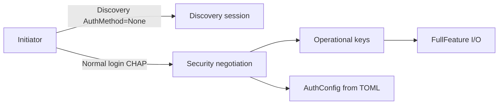

# Optional CHAP authentication

## Context

The vendored crate already implements RFC 3720 CHAP (MD5) and mutual CHAP:

- [`vendor/iscsi-target/src/auth.rs`](vendor/iscsi-target/src/auth.rs) — `AuthConfig::{None, Chap, MutualChap}`, `ChapCredentials`
- [`IscsiServerBuilder::add_target_with_auth`](vendor/iscsi-target/src/target.rs) — per-IQN auth + optional initiator ACL
- Normal login path already calls `AnySession::new_configured(auth_config, …)`

Today [`src/main.rs`](src/main.rs) always uses `add_target(...)`, which hard-codes `AuthConfig::None`. Discovery sessions intentionally stay unauthenticated (`AnySession::new()` with no auth) — that stays as-is for v1 (IQN list is still “public”; login secrets protect the LUN).



**Default choice for this plan:** optional **one-way CHAP** as the primary feature; **mutual CHAP** when mutual credentials are present; optional **initiator ACL** via the existing vendor parameter. No vendor protocol rewrite unless a real login bug shows up during smoke testing.

## Config model

Add to [`src/config.rs`](src/config.rs):

```toml
# Global default (omit = no auth, current behavior)
[auth]
username = "iscsiuser"
secret = "correct-horse"          # or use env — see below
# mutual_username = "targetid"    # enables MutualChap when both set
# mutual_secret = "..."
# allowed_initiators = ["iqn.1993-08.org.debian:01:abc"]

[[volumes]]
name = "disk0"
iqn = "iqn....:disk0"
# Optional per-volume override (inherits global if unset)
# [volumes.auth]  — use nested table or flat optional AuthConfig on VolumeConfig
```

Concrete Rust shape:

- `AuthSettings { username, secret, mutual_username, mutual_secret, allowed_initiators }`
- `Config.auth: Option<AuthSettings>` (or empty defaults)
- `VolumeConfig.auth: Option<AuthSettings>` — merge: volume fields override global; missing volume auth → global; neither → `AuthConfig::None`
- Helper `fn resolve_auth(global, volume) -> (AuthConfig, Option<Vec<String>>)`:
  - no username/secret → `None`
  - username+secret only → `AuthConfig::Chap { … }`
  - also mutual_* both set → `AuthConfig::MutualChap { … }`
  - partial mutual fields → config error at load time
  - secret empty with username set → config error

Env (figment `ISCSI_S3_`): support at least `ISCSI_S3_AUTH__USERNAME` / `ISCSI_S3_AUTH__SECRET` (and mutual equivalents) so secrets need not live in TOML. Do **not** add CLI flags for secrets (avoid argv leakage).

Never log secrets; log only `auth=chap|mutual-chap|none` and username at info on volume ready.

## Wiring

In [`src/main.rs`](src/main.rs) volume loop:

```rust
let (auth, acl) = resolve_auth(&cfg.auth, &vol.auth);
builder = builder.add_target_with_auth(
    opened.iqn,
    Box::new(device),
    Some(opened.name),
    auth,
    acl,
);
```

MPIO: document that **all path instances must share the same auth settings** (same as identical IQN/prefix).

## Docs and examples

- Update “no CHAP” callouts in [`README.md`](README.md), [`docs/users/configuration.md`](docs/users/configuration.md), [`docs/developers/architecture.md`](docs/developers/architecture.md), [`docs/examples.md`](docs/examples.md)
- New short section or example: enable CHAP + open-iscsi:

```bash
sudo iscsiadm -m node -T "$IQN" -p "$HOST:3260" \
  --op update -n node.session.auth.authmethod -v CHAP
sudo iscsiadm -m node -T "$IQN" -p "$HOST:3260" \
  --op update -n node.session.auth.username -v iscsiuser
sudo iscsiadm -m node -T "$IQN" -p "$HOST:3260" \
  --op update -n node.session.auth.password -v 'correct-horse'
sudo iscsiadm -m node -T "$IQN" -p "$HOST:3260" --login
```

- Note discovery remains unauthenticated; firmware boot + CHAP caveats if relevant
- Comment example block in [`config.example.toml`](config.example.toml) (no real secrets committed)
- Mention in [`docs/users/mpio.md`](docs/users/mpio.md): same `[auth]` on every instance

## Tests

- Unit tests for `resolve_auth` (none / chap / mutual / partial-mutual error / volume override)
- Config load smoke with TOML `[auth]` via existing figment test style
- Manual / doc-only open-iscsi check (smoke_client stays AuthMethod=None unless we add a tiny CHAP unit on vendor credentials validation — vendor already has auth tests)

## Out of scope

- Authenticating discovery sessions
- Multiple CHAP users per target (single username/secret per volume)
- Secret encryption at rest / HashiCorp Vault / etc.
- Changing vendor CHAP crypto (MD5 is what RFC 3720 / open-iscsi expect)