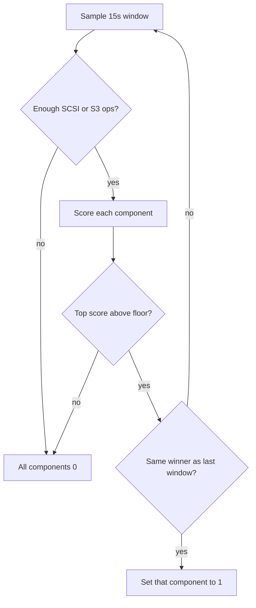

# Performance bottleneck analyser

Diagnostic only: the thread identifies the current bottleneck and logs it. It does not change cache sizes, flush policy, or iSCSI settings.

The scrape series follows the existing `iscsi_s3_` prefix so it groups with the rest of the registry: **`iscsi_s3_bottleneck{component="..."}`** is `0` or `1`. At most one component is `1` (the thing to chase). Idle or healthy windows leave every component at `0`. All five series are registered up front so Grafana legends stay stable.

## Components

- `s3_read` — GetObject time dominates SCSI reads
- `s3_write` — PutObject time dominates SCSI writes/flushes
- `read_cache` — read LRU is full and missing too often (working set larger than `cache.max_bytes`)
- `write_cache` — dirty write-back is pinned at `write_cache.max_bytes` and not draining
- `iscsi` — SCSI response time is high and is **not** explained by S3 time (local path, locks, RMW)

Vendor in-flight `pending_writes` are protocol assembly buffers, not a standing queue, so they are not a component.

Hysteresis: a new winner must lead for two consecutive windows before the gauge flips, so a Grafana panel does not flicker.

## How a window is scored

New module [`src/perf.rs`](src/perf.rs). The decision function takes a plain snapshot struct and returns `Option<Component>` so it can be unit-tested without a thread.

Hot path stays cheap. [`src/metrics.rs`](src/metrics.rs) adds process-wide atomic accumulators (count + sum of microseconds), updated inside the existing `observe_scsi`, `observe_s3`, and `observe_cache` calls. The thread diffs two snapshots to get window averages. No Prometheus text parsing.

Cache fill comes from existing hooks:

- Read LRU: [`ChunkCache::stats`](src/cache.rs) and `max_bytes()`
- Write-back: sum [`WriteCachedStore::dirty_bytes`](src/write_cache.rs) across volume `Arc`s, plus a new `max_bytes()` getter (budget `0` means unlimited and cannot be "full")

Rules (constants in `perf.rs`, documented, not config):

- Window **15s**. Ignore a signal with fewer than **8** ops in the window.
- `write_cache` leads when a budget is set, fill is at least **85%**, SCSI writes happened, and dirty bytes did not drop by at least **10%**.
- `read_cache` leads when a budget is set, fill is at least **90%**, and the miss ratio is at least **25%**.
- Otherwise compare time spent: `count * avg`. If Get time is the largest share of SCSI read time and average Get is at least **50ms**, `s3_read`. Same for Put vs SCSI write/flush, `s3_write`.
- `iscsi` only if SCSI average is at least **20ms** and S3 time is under **40%** of SCSI time (the leftover is the local path).
- Highest score wins. Tie-break: `write_cache`, `read_cache`, `s3_write`, `s3_read`, `iscsi`.

Each interval logs at info only when the lit component changes; the numbers stay at debug.

## Wiring

- CLI flag `--performance-optimiser` on [`Cli`](src/config.rs) (`bool`, default off). Process lifetime only — not a TOML field and not a reloadable setting. Update the existing `Cli { ... }` test literals.
- [`src/main.rs`](src/main.rs) starts a thread named `iscsi-s3-perf` after volumes are open, passing `Arc<Metrics>`, `Arc<ChunkCache>`, and the volume store `Arc`s. Same pattern as [`spawn_metrics_server`](src/metrics.rs).
- Gauge is an `IntGaugeVec` on the existing registry, so it appears on `GET /metrics` whenever metrics are enabled. If the flag is set with `--no-metrics`, still analyse and log, and warn once that Grafana will not see the series.
- Docs: short section in [`docs/users/configuration.md`](docs/users/configuration.md) (CLI + Grafana query `iscsi_s3_bottleneck`) and the scoring rules in [`docs/developers/cache.md`](docs/developers/cache.md) or a small [`docs/developers/performance.md`](docs/developers/performance.md) linked from architecture.
