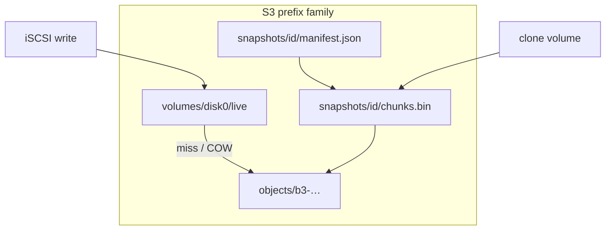

# Volume snapshots (CoW)

## Goals and non-goals

**Goals**
- Cheap snapshot create (metadata + refs, not a full chunk copy).
- Safe with current architecture: sparse chunks, compression, write-through cache, Path-A MPIO / multi-instance.
- Admin ops: create, list, delete, restore, clone-to-new-volume (or clone into empty configured volume).
- Crash-consistent under a clear quiesce policy (see below).

**Non-goals (v1)**
- Relying on S3 bucket versioning / object lock as the snapshot store.
- Application-consistent (fsfreeze) orchestration inside the daemon.
- Hot-add of new IQNs without restart (clone still needs a preconfigured empty volume or a restart to register a new volume).
- Shrinking or changing geometry via snapshot.
- Snapshots / COW on volumes explicitly configured as **legacy** (performance mode).

## Storage modes: `cow` vs `legacy`

Per-volume config chooses the on-disk layout. This is the “performance vs flexibility” switch.

| Mode | Layout | Hashing | Snapshots / clone / restore | I/O cost |
|------|--------|---------|------------------------------|----------|
| **`cow`** (default for new volumes that opt in, or after migration) | `{prefix}/live/` + `{prefix}/objects/` + snapshots | BLAKE3 on every present-chunk write | Full snapshot feature set | Extra hash + pointer put; payload is content-addressed |
| **`legacy`** | Today’s flat `{prefix}/meta.json` + `{prefix}/chunks/{016x}` **full payloads** | None | **Refused** (clear error) | Same as today’s path — no hash, no indirection |

**Config** ([src/config.rs](src/config.rs) `VolumeConfig`):

```toml
[[volumes]]
name = "disk0"
# ...
# storage = "cow"     # content-addressed; snapshots enabled
storage = "legacy"    # flat chunks; max I/O performance; no snapshots
```

- Enum: `legacy` | `cow` (serde string). **Default: `legacy`** so existing deployments keep current behavior and performance with zero surprise after upgrade.
- Locked in `meta.json` on first write / open (`storage` / `format` field). Changing `legacy` → `cow` later is an explicit migration (admin op or first successful `snapshot create` that upgrades); changing `cow` → `legacy` is **refused** (would require materializing every object back into flat chunk blobs).
- Admin summary / `volume list` shows `storage=legacy|cow`.
- Snapshot CLI on a legacy volume: error like `volume disk0 uses storage=legacy; set storage=\"cow\" (and migrate) to use snapshots`.

**Why keep legacy:** hashing every multi-MiB write, plus an extra pointer object put, is real overhead for volumes that never need PITR/clones (e.g. scratch, high-churn cache disks). Operators pick flexibility only where they want it.

**Mixed daemon:** one process may serve both legacy and cow volumes; code paths branch in `S3ChunkStore` (or a thin wrapper) based on the locked mode.

Default (efficient + safe): **immutable snapshot objects + live volume overlay**, not full prefix clones.



**Why this vs alternatives**
- Full prefix copy (today’s `volume.copy` style): simple but O(used data) time/cost per snapshot; not “big feature” efficient.
- S3 versioning on live keys: weak semantics for sparse deletes, hard to list a PIT view, couples to bucket policy, conflicts with multi-writer CAS story.
- Pure hardlink-style “same key shared across prefixes” without content addressing: delete/refcount bugs and cross-volume cache key collisions.

## Storage layout

Keep each live volume’s current keys working; introduce a **shared object pool** and **snapshot descriptors** beside the volume.

```text
{family}/live/meta.json              # existing VolumeMeta (+ snapshot_gen)
{family}/live/chunks/{016x}          # thin pointer (binary) OR legacy blob (migration)
{family}/objects/{blake3hex}         # immutable chunk payloads (32-byte BLAKE3)
{family}/snapshots/{id}/manifest.json  # SMALL header only (no per-chunk map)
{family}/snapshots/{id}/chunks.bin     # compact present-chunk index
```

**Migration (v1 approach):** on first snapshot of a volume, rewrite present live chunks into content-addressed `objects/` and replace live chunk keys with small **binary pointer objects** (fixed header: magic + hash algo id + 32-byte BLAKE3; not JSON). Unwritten sparse holes remain absent. Subsequent writes COW: write new object, update live pointer.

### Content hash: BLAKE3 (not SHA-256)

Use **BLAKE3** (default 32-byte digest) for content addressing:

- Much faster than SHA-256 on multi-MiB chunks (typical `chunk_size`), which matters on every COW write and on migration.
- Still suitable for collision-resistant content addressing.
- Same 32-byte record width as a SHA-256 plan would have used in `chunks.bin`.
- Rust: `blake3` crate; hash the **on-disk object bytes** as stored in S3 (post-compression / `ISC3` framing), so the address binds the exact payload peers will GET.

Object key: `{family}/objects/{lowercase_hex_blake3}` (64 hex chars). Pointer / `chunks.bin` store raw 32 bytes. `manifest.json` records `hash_algo: "blake3"` so a future algo bump is explicit (v1 supports only blake3).

`VolumeMeta` gains fields (version bump carefully, or additive defaults):
- `storage` / `format`: `legacy` | `cow-v1` (must match config; mismatch → refuse start)
- `snapshot_gen` / `family` id when `cow-v1`

### Snapshot metadata format (not a giant JSON map)

**Do not** store `chunks: { index → hash }` as one JSON object. At scale that is the wrong tool:

| Present chunks | Rough JSON map size | Notes |
|----------------|---------------------|--------|
| ~1k (sparse / small) | low hundreds of KB | tolerable |
| ~260k (1 TiB @ 4 MiB full) | tens of MB | painful to parse/rewrite; bad for S3 GET of whole manifest |
| millions | untenable | |

Sparse volumes only record **present** chunks, but a fully written large disk still blows up a JSON map.

**v1 format:**
- `manifest.json` — small header only: `id`, `created_at`, `parent`, `source_volume`, `capacity`, `chunk_size`, `block_size`, `compression`, `chunk_count`, `chunks_object` (`chunks.bin`), `state` (`ready` \| `creating` \| `deleting`), `format_version`.
- `chunks.bin` — sorted fixed-width records, streamable:

```text
magic "ISC3SNAP" | u32 version | u64 count
repeated: u64 chunk_index (BE) | [u8; 32] blake3
```

Properties: ~40 bytes/chunk, mmap/stream friendly, binary-searchable by index, no JSON parse cost, easy to GC (scan hashes). Create builds the file once and PUTs it; restore/clone streams it without loading a huge DOM.

**Rejected for v1:** JSON Lines of chunk records (better than one map, still bulkier/slower than binary). Snapshot-as-copied pointer tree under `snapshots/{id}/chunks/{016x}` (scales via ListObjects, more S3 ops per create; keep as a future alternative if single-object size limits become an issue — `chunks.bin` for 1 TiB full is ~10 MiB, well within normal object sizes).

### Memory model (no write-back chunk map)

**No.** The design does **not** keep a full volume chunk map in process memory and flush it to S3 later.

| What | Where truth lives | In memory |
|------|-------------------|-----------|
| Live chunk → hash | One small S3 pointer object per present index (`live/chunks/{016x}`) | Only whatever the existing plaintext **chunk cache** holds; each write updates the pointer object immediately (same write-through discipline as today) |
| Snapshot index | Immutable `chunks.bin` on S3 after create completes | Built during `snapshot create` (stream/list live pointers → temp file or streaming multipart PUT), then dropped; restore/clone **streams** `chunks.bin` and writes pointers; does not retain the whole index afterward |
| Snapshot header | `manifest.json` | Tiny; list ops only load headers |

So normal I/O stays **per-chunk, write-through to S3**, like today’s layout. `chunks.bin` is a **point-in-time artifact**, not a dirty in-memory map. That keeps MPIO/multi-instance coherent (S3 remains source of truth) and avoids “daemon crash loses the map” failure modes.

Optional later: a small LRU of *pointer* resolutions (index → hash) separate from the data cache; still not a full dirty map.

## Consistency and safety policy

**Quiesce required for create/restore (v1):**
- Refuse `snapshot create` / `restore` if the volume has active FullFeature sessions (`volume sessions` / session registry), unless `--force` (document crash-consistent best-effort).
- On multi-instance MPIO: document that **all peers** must have `cache.max_bytes = 0`, and preferably only one admin node runs snapshot ops; create still lists live pointers from S3 (source of truth), not from cache.
- Before create: invalidate that volume’s cache entries (extend cache with volume-scoped invalidate if needed).
- Restore: wipe live pointers in range, install manifest mapping, invalidate cache; prefer no sessions.

This matches existing cache/MPIO docs: peers must not serve stale LRU data; S3 is truth.

## Runtime read/write path changes ([src/store/s3.rs](src/store/s3.rs))

- **Read:** resolve live pointer → `GetObject` from `objects/{hash}` → decode; missing = zeros (unchanged sparse semantics).
- **Write (COW):** encode payload → put immutable object (if-not-exists / ignore already-exists) → put/replace live pointer (with CAS on pointer where possible) → never mutate shared snapshot objects.
- **Delete chunk (wipe / sparse restore):** delete live pointer only; GC of unreferenced objects is separate.
- Stripe locks remain per chunk index on the live volume.
- `CachedStore` continues to cache **plaintext by (volume, index)**; COW is invisible above the store.

## GC

- Refcount by scanning every snapshot’s `chunks.bin` plus live pointer objects (hash sets).
- `snapshot delete` removes `manifest.json` + `chunks.bin`; then GC unreferenced `objects/`.
- v1: **synchronous GC on delete** is acceptable; document background GC as a later optimization for huge pools.

## Admin / CLI surface ([src/admin.rs](src/admin.rs), [src/bin/iscsi-s3-ctl.rs](src/bin/iscsi-s3-ctl.rs))

| Command | Behavior |
|---------|----------|
| `volume snapshot create <vol> [--name ID]` | Quiesce check → build `chunks.bin` from live pointers + small `manifest.json` → mark ready |
| `volume snapshot list <vol>` | List snapshot headers only (`manifest.json`; no need to download `chunks.bin`) |
| `volume snapshot delete <vol> <id> [--force]` | Delete manifest + `chunks.bin` + GC unreferenced objects |
| `volume snapshot restore <vol> <id> [--force]` | Quiesce → stream `chunks.bin` to replace live pointers (capacity ≥ snap; grow-only if needed) |
| `volume snapshot clone <vol> <id> --to <dest>` | Dest empty + matching geometry; stream `chunks.bin` to install shared object pointers |

Reuse confirmation patterns from wipe/copy. Do **not** send snapshot payloads over the admin socket (S3-side only).

## Interactions with existing ops

- **`volume.copy`:** can stay as full logical copy, or later become “clone + optional materialize”; leave as-is for v1.
- **`volume.wipe`:** delete live pointers only; does not delete snapshots.
- **`volume.grow`:** live meta only; snapshots retain their recorded capacity.
- **`write-image` / `export`:** work through BlockStore unchanged once COW is under the store.
- **Config:** 
  - `volumes[].storage = "legacy" | "cow"` (default **`legacy`**).
  - For `cow`, `prefix` is the family root with `live/` + `objects/` + `snapshots/` underneath.
  - For `legacy`, `prefix` stays the flat layout used today (`meta.json` + `chunks/{016x}` payloads).
  - Open auto-detects existing flat data as legacy if meta has no storage field; does **not** auto-upgrade to cow.
- **Upgrade legacy → cow:** explicit only (documented admin/migrate path or first `snapshot create` after setting `storage = "cow"` in config and restarting); never implicit on ordinary open.

## MPIO / multi-instance

- Snapshot create/restore/clone are **admin-single-writer** operations; peers must not write the same volume during the op.
- With cache disabled on all peers, readers see new pointers after S3 listing/get (no cross-process cache invalidation needed).
- Instant clone of a second IQN still requires the destination volume to exist in config (restart to add IQN unless hot-add is built later).

## Implementation phases

1. **`storage` config + meta lock** (`legacy` default); keep current I/O path for legacy; scaffold cow types without forcing migration.
2. **Cow pointer format + object pool + BLAKE3**; read/write path for `storage=cow` only; tests.
3. **`snapshot create/list/delete`** + GC (cow only); refuse on legacy; admin/ctl + docs.
4. **`restore` + `clone`** into empty cow volume; quiesce/session checks; cache invalidate.
5. **Explicit legacy → cow migrate** helper (optional ctl command); docs for choosing modes.
6. **Hardening:** CAS on pointer updates, concurrent write tests, multi-instance checklist (`cache.max_bytes = 0`, disconnect before restore).

## Testing focus

- COW: write after snapshot does not change snapshot read-back.
- Sparse: unwritten holes stay absent in manifests.
- Clone shares object keys; delete one clone’s live data does not break the other; GC only after all refs gone.
- Restore with sessions present → refused without `--force`.
- Compression round-trip unchanged through object pool.
- Migration: legacy volume open stays legacy; cow path only when configured; explicit upgrade tested.
- Snapshot ops on `storage=legacy` return a clear error.

## Docs to add/update

- New [docs/users/snapshots.md](docs/users/snapshots.md) (create/list/delete/restore/clone, quiesce, MPIO, **legacy vs cow**).
- [docs/users/admin-ctl.md](docs/users/admin-ctl.md) command table.
- [docs/users/configuration.md](docs/users/configuration.md) `volumes[].storage`.
- [docs/developers/architecture.md](docs/developers/architecture.md) object layout per mode.
- [docs/developers/cache.md](docs/developers/cache.md) note: snapshot ops invalidate volume cache; multi-instance still requires cache off.
